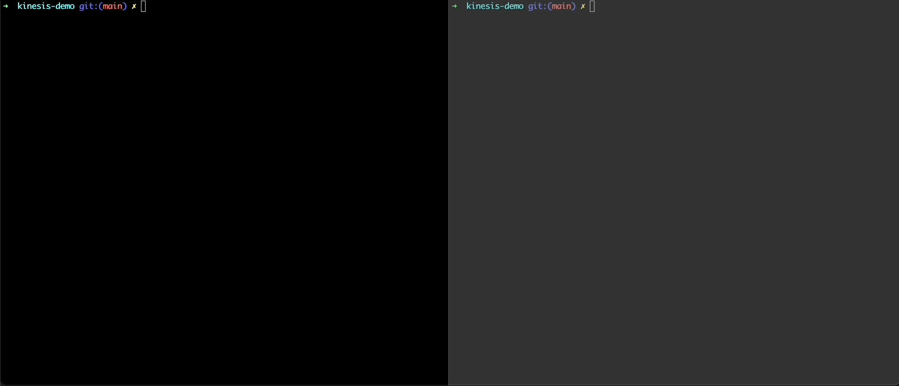
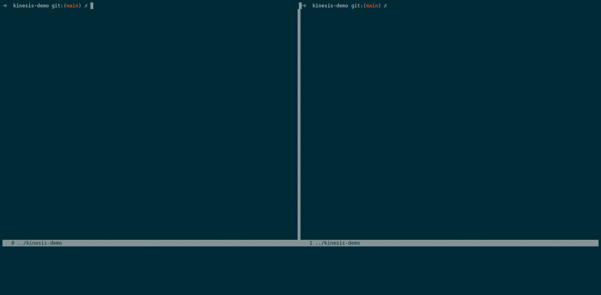

# kinesis-demo
 example apps showcasing various capabilities provided by [kinesis](https://github.com/srcfoundry/kinesis)

<br>

## kinesis-app1

Kinesis-app1 is an example to showcase the flexibility of dynamically adding and shutting down components within an application, in addition to its endpoints. 
<br>

The example shows that the http endpoint (/kinesis-app1/comp1) for "comp1" component getting dynamically added and GET query on the same returning details about comp1. 
Similarly, when "comp1" is shutdown after a few seconds, the http routes to it get removed and a GET on the endpoint yields "{"status":"not found"}"

<br>



<br>

#### Running
- execute ```while sleep 2; do curl http://127.0.0.1:8080/kinesis-app1/comp1; echo -e '\n'; done``` to repeatedly query "kinesis-app1/comp1" endpoint.
- on another console execute ```go run cmd/kinesis-app1/kinesis-app1.go <shutdown-delay>```, whereby "comp1" component would be shutdown after <b>"shutdown-delay"</b> seconds have elapsed.


<br>
<br>

## kinesis-app2

Kinesis-app2 showcase a Key-Value (KV) store example which could be interacted using RESTful APIs'. Unique keys with associated values are grouped within a 'bucket'. KV tuples could be created, read, updated & deleted using REST over http. 

The following example represents collection of user theme preferences maintained within "themes" bucket & user app session states maintained within "user283session" bucket.

<br>

**_- Bucket: themes_**
<br>
&emsp;&emsp;<user776:> theme1\
&emsp;&emsp;<user283:> theme32\
&emsp;&emsp;<user004:> theme19\
&emsp;&emsp;...\
&emsp;&emsp;...
<br>
<br>

**_- Bucket: user283session_**
<br>
&emsp;&emsp;<iOS:> {"iOS_ver":"15.3", "app_ver":"1.0.34", "session_id":"ed4-4e2-965-7b5"}\
&emsp;&emsp;<ChromeOS:> {"ChromeOS_ver":"14695.87", "app_ver":"1.1.118", "session_id":"a4f-14b-44d-9fa-8cf"}\
&emsp;&emsp;<a4f-14b-44d-9fa-8cf:> {"session_auth":"google", "session_state":"cart"}\
&emsp;&emsp;<ed4-4e2-965-7b5:> {"session_auth":"google", "session_state":"home"}\
&emsp;&emsp;...\
&emsp;&emsp;...

<br>

The KV tuples could be referenced using URI hierarchy ```"/kv/{bucket:[a-zA-Z0-9_.-]+}/{key:[a-zA-Z0-9_.-]+}"```. 

Using POST, leads to the creation of new KV tuples and the underlying bucket if it does not exist. PUT method calls may be used to update an existing KV tuple and would be treated as a POST call, if one does'nt exist.

Initially when the app starts, all KV tuple POST/PUT calls are handled by the http handler within "kv" component, available at "/kv" URI endpoint. Every KV POST/PUT call containing a new bucket name, would result in a new bucket component getting initialized, by the "/kv" endopint handler. Thereafter all subsequent REST calls which contains the bucket name within the URI path, would be redirected to the appropriate bucket's http handler.

<br>



<br>
